[](../../)
[](../../)
[](../../issues)
[](/LICENSE.md)
[](../../commits/master)
[](../../commits/master)
[](https://pypistats.org/packages/blendmodes)
[](https://pepy.tech/project/blendmodes)
[](https://pypi.org/project/blendmodes)

<!-- omit in TOC -->
# BlendModes


Use this module to apply a number of blending modes to a background and
foreground image.

## Credits

Credits to:

### MIT License Copyright (c) 2019 Paul Jewell
For implementing blending from the Open Raster Image Spec

### MIT License Copyright (c) 2018 Addison Elliott
For implementing blending from Paint.NET

### MIT License Copyright (c) 2017 pashango
For implementing a number of blending functions used by other popular image
editors

- [Credits](#credits)
	- [MIT License Copyright (c) 2019 Paul Jewell](#mit-license-copyright-c-2019-paul-jewell)
	- [MIT License Copyright (c) 2018 Addison Elliott](#mit-license-copyright-c-2018-addison-elliott)
	- [MIT License Copyright (c) 2017 pashango](#mit-license-copyright-c-2017-pashango)
- [Examples](#examples)
	- [Normal](#normal)
	- [Multiply](#multiply)
	- [Additive](#additive)
	- [ColourBurn](#colourburn)
	- [ColourDodge](#colourdodge)
	- [Reflect](#reflect)
	- [Glow](#glow)
	- [Overlay](#overlay)
	- [Difference](#difference)
	- [Negation](#negation)
	- [Lighten](#lighten)
	- [Darken](#darken)
	- [Screen](#screen)
	- [XOR](#xor)
	- [SoftLight](#softlight)
	- [HardLight](#hardlight)
	- [GrainExtract](#grainextract)
	- [GrainMerge](#grainmerge)
	- [Divide](#divide)
	- [Hue](#hue)
	- [Saturation](#saturation)
	- [Colour](#colour)
	- [Luminosity](#luminosity)
	- [PinLight](#pinlight)
	- [VividLight](#vividlight)
	- [Exclusion](#exclusion)
	- [DestIn](#destin)
	- [DestOut](#destout)
	- [DestAtop](#destatop)
	- [SrcAtop](#srcatop)
- [Documentation](#documentation)
- [Install With PIP](#install-with-pip)
- [Language information](#language-information)
	- [Built for](#built-for)
- [Install Python on Windows](#install-python-on-windows)
	- [Chocolatey](#chocolatey)
	- [Windows - Python.org](#windows---pythonorg)
- [Install Python on Linux](#install-python-on-linux)
	- [Apt](#apt)
	- [Dnf](#dnf)
- [Install Python on MacOS](#install-python-on-macos)
	- [Homebrew](#homebrew)
	- [MacOS - Python.org](#macos---pythonorg)
- [How to run](#how-to-run)
	- [Windows](#windows)
	- [Linux/ MacOS](#linux-macos)
- [Download Project](#download-project)
	- [Clone](#clone)
		- [Using The Command Line](#using-the-command-line)
		- [Using GitHub Desktop](#using-github-desktop)
	- [Download Zip File](#download-zip-file)
- [Community Files](#community-files)
	- [Licence](#licence)
	- [Changelog](#changelog)
	- [Code of Conduct](#code-of-conduct)
	- [Contributing](#contributing)
	- [Security](#security)
	- [Support](#support)
	- [Rationale](#rationale)

## Examples

Be sure to include the following for the functions below

```python
from blendmodes.blend import blendLayers, BlendType

background = Image.open(THISDIR + "/background.png")
foreground = Image.open(THISDIR + "/foreground.png")
```

### Normal

```python
blendLayers(background, foreground, BlendType.NORMAL)
```


### Multiply

```python
blendLayers(background, foreground, BlendType.MULTIPLY)
```

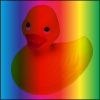

### Additive

```python
blendLayers(background, foreground, BlendType.ADDITIVE)
```


### ColourBurn

```python
blendLayers(background, foreground, BlendType.COLOURBURN)
```

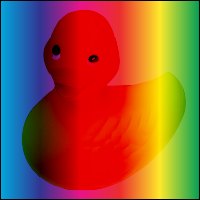

### ColourDodge

```python
blendLayers(background, foreground, BlendType.COLOURDODGE)
```


### Reflect

```python
blendLayers(background, foreground, BlendType.REFLECT)
```

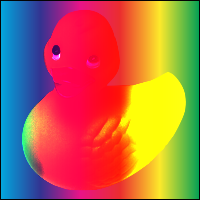

### Glow

```python
blendLayers(background, foreground, BlendType.GLOW)
```


### Overlay

```python
blendLayers(background, foreground, BlendType.OVERLAY)
```

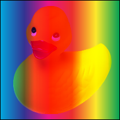

### Difference

```python
blendLayers(background, foreground, BlendType.DIFFERENCE)
```

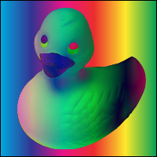

### Negation

```python
blendLayers(background, foreground, BlendType.NEGATION)
```

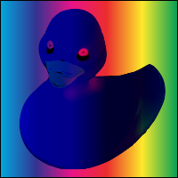

### Lighten

```python
blendLayers(background, foreground, BlendType.LIGHTEN)
```


### Darken

```python
blendLayers(background, foreground, BlendType.DARKEN)
```

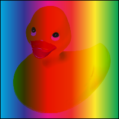

### Screen

```python
blendLayers(background, foreground, BlendType.SCREEN)
```


### XOR

```python
blendLayers(background, foreground, BlendType.XOR)
```

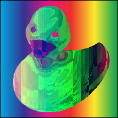

### SoftLight

```python
blendLayers(background, foreground, BlendType.SOFTLIGHT)
```

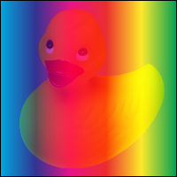

### HardLight

```python
blendLayers(background, foreground, BlendType.HARDLIGHT)
```


### GrainExtract

```python
blendLayers(background, foreground, BlendType.GRAINEXTRACT)
```

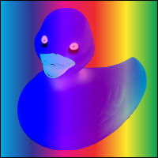

### GrainMerge

```python
blendLayers(background, foreground, BlendType.GRAINMERGE)
```

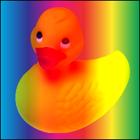

### Divide

```python
blendLayers(background, foreground, BlendType.DIVIDE)
```

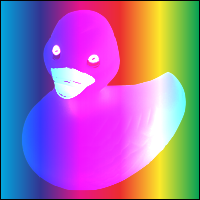

### Hue

```python
blendLayers(background, foreground, BlendType.HUE)
```

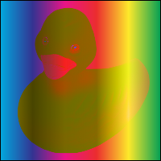

### Saturation

```python
blendLayers(background, foreground, BlendType.SATURATION)
```

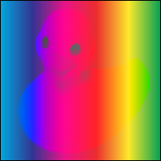

### Colour

```python
blendLayers(background, foreground, BlendType.COLOUR)
```

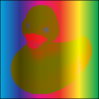

### Luminosity

```python
blendLayers(background, foreground, BlendType.LUMINOSITY)
```


### PinLight

```python
blendLayers(background, foreground, BlendType.PINLIGHT)
```


### VividLight

```python
blendLayers(background, foreground, BlendType.VIVIDLIGHT)
```


### Exclusion

```python
blendLayers(background, foreground, BlendType.EXCLUSION)
```

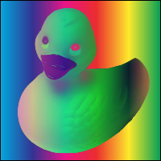

### DestIn

```python
blendLayers(background, foreground, BlendType.DESTIN)
```


### DestOut

```python
blendLayers(background, foreground, BlendType.DESTOUT)
```


### DestAtop

```python
blendLayers(background, foreground, BlendType.DESTATOP)
```


### SrcAtop

```python
blendLayers(background, foreground, BlendType.SRCATOP)
```


## Documentation
See the [Docs](/DOCS/) for more information.

## Install With PIP

```python
pip install blendmodes
```

Head to https://pypi.org/project/blendmodes/ for more info

## Language information

### Built for
This program has been written for Python versions 3.7 - 3.10 and has been tested with both 3.7 and
3.10

## Install Python on Windows

### Chocolatey

```powershell
choco install python
```

### Windows - Python.org
To install Python, go to https://www.python.org/downloads/windows/ and download the latest
version.

## Install Python on Linux

### Apt

```bash
sudo apt install python3.x
```

### Dnf

```bash
sudo dnf install python3.x
```

## Install Python on MacOS

### Homebrew

```bash
brew install python@3.x
```

### MacOS - Python.org
To install Python, go to https://www.python.org/downloads/macos/ and download the latest
version.

## How to run

### Windows

- Module
	`py -3.x -m [module]` or `[module]` (if module installs a script)

- File
	`py -3.x [file]` or `./[file]`

### Linux/ MacOS

- Module
	`python3.x -m [module]` or `[module]` (if module installs a script)

- File
	`python3.x [file]` or `./[file]`

## Download Project

### Clone
#### Using The Command Line

1. Press the Clone or download button in the top right
2. Copy the URL (link)
3. Open the command line and change directory to where you wish to
clone to
4. Type 'git clone' followed by URL in step 2

	```bash
	git clone https://github.com/FHPythonUtils/BlendModes
	```

More information can be found at
https://help.github.com/en/articles/cloning-a-repository

#### Using GitHub Desktop

1. Press the Clone or download button in the top right
2. Click open in desktop
3. Choose the path for where you want and click Clone

More information can be found at
https://help.github.com/en/desktop/contributing-to-projects/cloning-a-repository-from-github-to-github-desktop

### Download Zip File

1. Download this GitHub repository
2. Extract the zip archive
3. Copy/ move to the desired location

## Community Files
### Licence
MIT License
(See the [LICENSE](/LICENSE.md) for more information.)

### Changelog
See the [Changelog](/CHANGELOG.md) for more information.

### Code of Conduct
Online communities include people from many backgrounds. The *Project*
contributors are committed to providing a friendly, safe and welcoming
environment for all. Please see the
[Code of Conduct](https://github.com/FHPythonUtils/.github/blob/master/CODE_OF_CONDUCT.md)
 for more information.

### Contributing
Contributions are welcome, please see the
[Contributing Guidelines](https://github.com/FHPythonUtils/.github/blob/master/CONTRIBUTING.md)
for more information.

### Security
Thank you for improving the security of the project, please see the
[Security Policy](https://github.com/FHPythonUtils/.github/blob/master/SECURITY.md)
for more information.

### Support
Thank you for using this project, I hope it is of use to you. Please be aware that
those involved with the project often do so for fun along with other commitments
(such as work, family, etc). Please see the
[Support Policy](https://github.com/FHPythonUtils/.github/blob/master/SUPPORT.md)
for more information.

### Rationale
The rationale acts as a guide to various processes regarding projects such as
the versioning scheme and the programming styles used. Please see the
[Rationale](https://github.com/FHPythonUtils/.github/blob/master/RATIONALE.md)
for more information.
