# Getting Started - Examples

Be sure to include the following for the functions below

```python
from blendmodes.blend import blendLayers, BlendType

background = Image.open(THISDIR + "/background.png")
foreground = Image.open(THISDIR + "/foreground.png")
```

## Normal

```python
blendLayers(background, foreground, BlendType.NORMAL)
```


## Multiply

```python
blendLayers(background, foreground, BlendType.MULTIPLY)
```

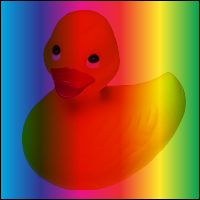

## Additive

```python
blendLayers(background, foreground, BlendType.ADDITIVE)
```


## ColourBurn

```python
blendLayers(background, foreground, BlendType.COLOURBURN)
```


## ColourDodge

```python
blendLayers(background, foreground, BlendType.COLOURDODGE)
```

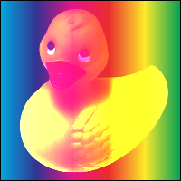

## Reflect

```python
blendLayers(background, foreground, BlendType.REFLECT)
```

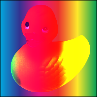

## Glow

```python
blendLayers(background, foreground, BlendType.GLOW)
```


## Overlay

```python
blendLayers(background, foreground, BlendType.OVERLAY)
```

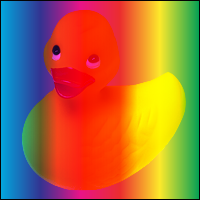

## Difference

```python
blendLayers(background, foreground, BlendType.DIFFERENCE)
```

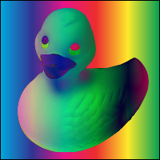

## Negation

```python
blendLayers(background, foreground, BlendType.NEGATION)
```

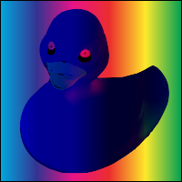

## Lighten

```python
blendLayers(background, foreground, BlendType.LIGHTEN)
```


## Darken

```python
blendLayers(background, foreground, BlendType.DARKEN)
```


## Screen

```python
blendLayers(background, foreground, BlendType.SCREEN)
```

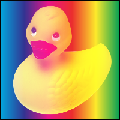

## XOR

```python
blendLayers(background, foreground, BlendType.XOR)
```


## SoftLight

```python
blendLayers(background, foreground, BlendType.SOFTLIGHT)
```

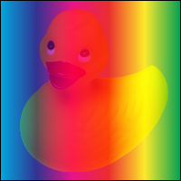

## HardLight

```python
blendLayers(background, foreground, BlendType.HARDLIGHT)
```


## GrainExtract

```python
blendLayers(background, foreground, BlendType.GRAINEXTRACT)
```


## GrainMerge

```python
blendLayers(background, foreground, BlendType.GRAINMERGE)
```


## Divide

```python
blendLayers(background, foreground, BlendType.DIVIDE)
```

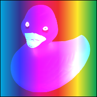

## Hue

```python
blendLayers(background, foreground, BlendType.HUE)
```

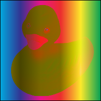

## Saturation

```python
blendLayers(background, foreground, BlendType.SATURATION)
```

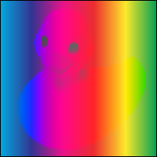

## Colour

```python
blendLayers(background, foreground, BlendType.COLOUR)
```

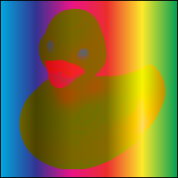

## Luminosity

```python
blendLayers(background, foreground, BlendType.LUMINOSITY)
```


## PinLight

```python
blendLayers(background, foreground, BlendType.PINLIGHT)
```

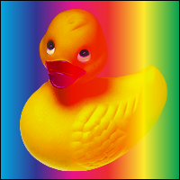

## VividLight

```python
blendLayers(background, foreground, BlendType.VIVIDLIGHT)
```


## Exclusion

```python
blendLayers(background, foreground, BlendType.EXCLUSION)
```

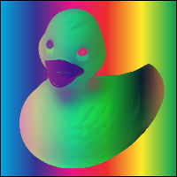

## DestIn

```python
blendLayers(background, foreground, BlendType.DESTIN)
```


## DestOut

```python
blendLayers(background, foreground, BlendType.DESTOUT)
```

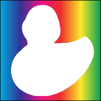

## DestAtop

```python
blendLayers(background, foreground, BlendType.DESTATOP)
```


## SrcAtop

```python
blendLayers(background, foreground, BlendType.SRCATOP)
```

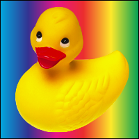
