# Getting Started - Examples

Below, you'll find practical examples to help you get started with blending/compositing
images with the `blendmodes` library. Whether you're experimenting with simple overlays
or crafting intricate compositions, these examples will guide you through the process.

To begin, let’s take a look at our two source images:

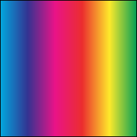


We'll use these images as our **background** and **foreground** in the examples below.

To blend two images together, use the `blendLayers` function with your chosen blend mode:

```python
from blendmodes.blend import blendLayers, BlendType

background = Image.open(THISDIR + "/rainbow.png")
foreground = Image.open(THISDIR + "/duck.png")
```

Blend modes define how the **foreground** interacts with the **background**. Let’s start with the most fundamental mode:

## Normal

The **Normal** blend mode places the foreground image on top of the background without
any additional blending effects.

```python
blendLayers(background, foreground, BlendType.NORMAL)
```


Further examples of different blend types using `rainbow.png` and `duck.png` are as below

Note: for other composition examples (without code snippets), check out the [extended blend mode examples](blend_examples.md).

## Multiply

```python
blendLayers(background, foreground, BlendType.MULTIPLY)
```


## Additive

```python
blendLayers(background, foreground, BlendType.ADDITIVE)
```


## ColourBurn

```python
blendLayers(background, foreground, BlendType.COLOURBURN)
```

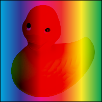

## ColourDodge

```python
blendLayers(background, foreground, BlendType.COLOURDODGE)
```


## Reflect

```python
blendLayers(background, foreground, BlendType.REFLECT)
```


## Glow

```python
blendLayers(background, foreground, BlendType.GLOW)
```


## Overlay

```python
blendLayers(background, foreground, BlendType.OVERLAY)
```


## Difference

```python
blendLayers(background, foreground, BlendType.DIFFERENCE)
```


## Negation

```python
blendLayers(background, foreground, BlendType.NEGATION)
```


## Lighten

```python
blendLayers(background, foreground, BlendType.LIGHTEN)
```

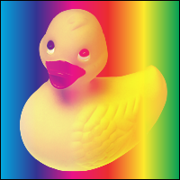

## Darken

```python
blendLayers(background, foreground, BlendType.DARKEN)
```

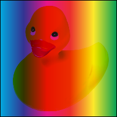

## Screen

```python
blendLayers(background, foreground, BlendType.SCREEN)
```


## XOR

```python
blendLayers(background, foreground, BlendType.XOR)
```

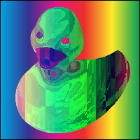

## SoftLight

```python
blendLayers(background, foreground, BlendType.SOFTLIGHT)
```


## HardLight

```python
blendLayers(background, foreground, BlendType.HARDLIGHT)
```

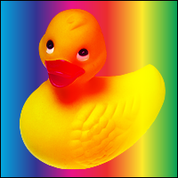

## GrainExtract

```python
blendLayers(background, foreground, BlendType.GRAINEXTRACT)
```

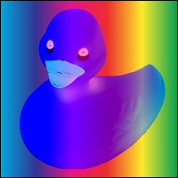

## GrainMerge

```python
blendLayers(background, foreground, BlendType.GRAINMERGE)
```

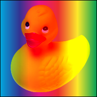

## Divide

```python
blendLayers(background, foreground, BlendType.DIVIDE)
```


## Hue

```python
blendLayers(background, foreground, BlendType.HUE)
```


## Saturation

```python
blendLayers(background, foreground, BlendType.SATURATION)
```


## Colour

```python
blendLayers(background, foreground, BlendType.COLOUR)
```


## Luminosity

```python
blendLayers(background, foreground, BlendType.LUMINOSITY)
```

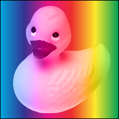

## PinLight

```python
blendLayers(background, foreground, BlendType.PINLIGHT)
```


## VividLight

```python
blendLayers(background, foreground, BlendType.VIVIDLIGHT)
```

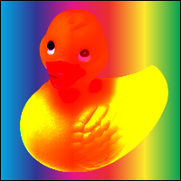

## Exclusion

```python
blendLayers(background, foreground, BlendType.EXCLUSION)
```


## DestIn

```python
blendLayers(background, foreground, BlendType.DESTIN)
```


## DestOut

```python
blendLayers(background, foreground, BlendType.DESTOUT)
```

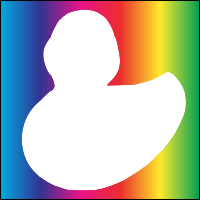

## DestAtop

```python
blendLayers(background, foreground, BlendType.DESTATOP)
```


## SrcAtop

```python
blendLayers(background, foreground, BlendType.SRCATOP)
```


