## Normal

| Case | Background | Foreground | Output |
|------|---------|------|--------|
| Case 1 |  |  |  |
| Case 2 | 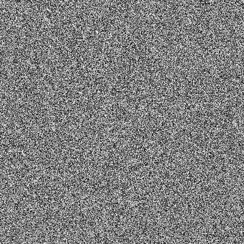 |  | 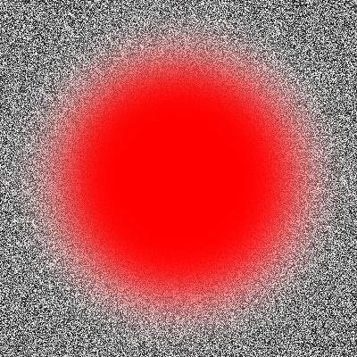 |
| Case 2 |  |  |  |

## Multiply

| Case | Background | Foreground | Output |
|------|---------|------|--------|
| Case 1 |  |  |  |
| Case 2 |  |  | 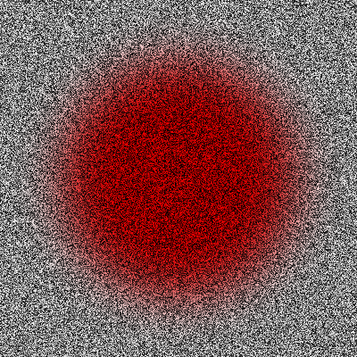 |
| Case 2 |  |  |  |

## Additive

| Case | Background | Foreground | Output |
|------|---------|------|--------|
| Case 1 |  |  |  |
| Case 2 |  |  |  |
| Case 2 |  |  |  |

## Colourburn

| Case | Background | Foreground | Output |
|------|---------|------|--------|
| Case 1 |  |  |  |
| Case 2 |  |  | 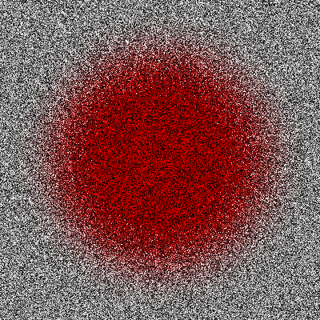 |
| Case 2 |  |  |  |

## Colourdodge

| Case | Background | Foreground | Output |
|------|---------|------|--------|
| Case 1 |  |  |  |
| Case 2 |  |  | 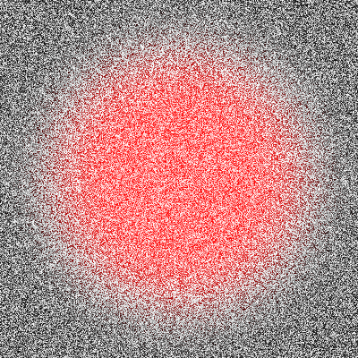 |
| Case 2 |  |  |  |

## Reflect

| Case | Background | Foreground | Output |
|------|---------|------|--------|
| Case 1 |  |  |  |
| Case 2 |  |  | 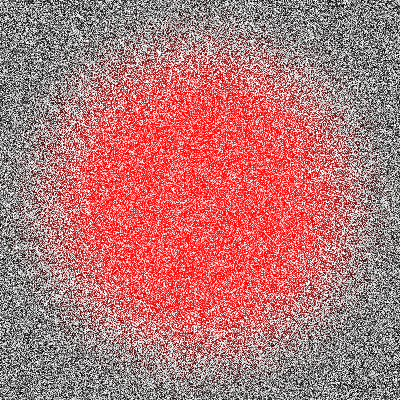 |
| Case 2 |  |  | 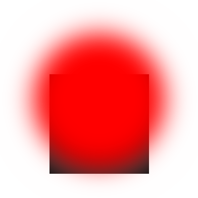 |

## Glow

| Case | Background | Foreground | Output |
|------|---------|------|--------|
| Case 1 |  |  |  |
| Case 2 |  |  |  |
| Case 2 |  |  |  |

## Overlay

| Case | Background | Foreground | Output |
|------|---------|------|--------|
| Case 1 |  |  |  |
| Case 2 |  |  | 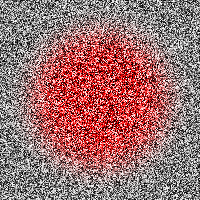 |
| Case 2 |  |  | 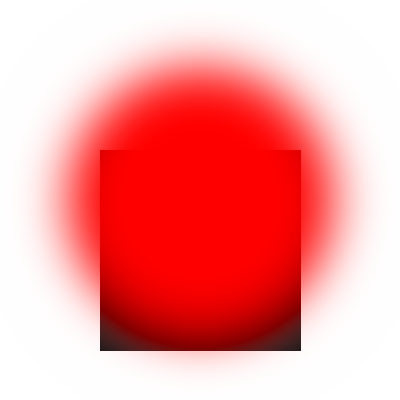 |

## Difference

| Case | Background | Foreground | Output |
|------|---------|------|--------|
| Case 1 |  |  |  |
| Case 2 |  |  | 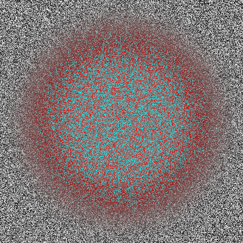 |
| Case 2 |  |  | 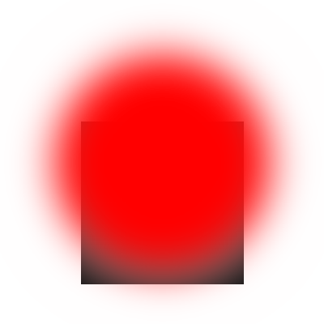 |

## Negation

| Case | Background | Foreground | Output |
|------|---------|------|--------|
| Case 1 |  |  |  |
| Case 2 |  |  | 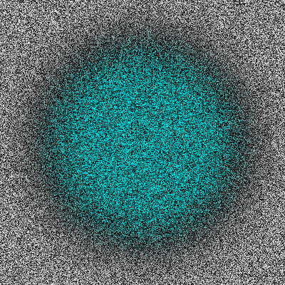 |
| Case 2 |  |  |  |

## Lighten

| Case | Background | Foreground | Output |
|------|---------|------|--------|
| Case 1 |  |  |  |
| Case 2 |  |  | 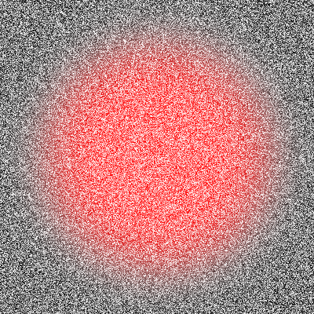 |
| Case 2 |  |  |  |

## Darken

| Case | Background | Foreground | Output |
|------|---------|------|--------|
| Case 1 |  |  |  |
| Case 2 |  |  | 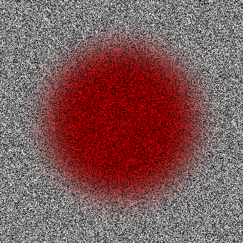 |
| Case 2 |  |  |  |

## Screen

| Case | Background | Foreground | Output |
|------|---------|------|--------|
| Case 1 |  |  |  |
| Case 2 |  |  | 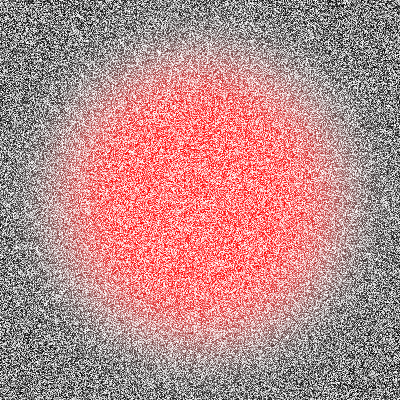 |
| Case 2 |  |  |  |

## Xor

| Case | Background | Foreground | Output |
|------|---------|------|--------|
| Case 1 |  |  |  |
| Case 2 |  |  | 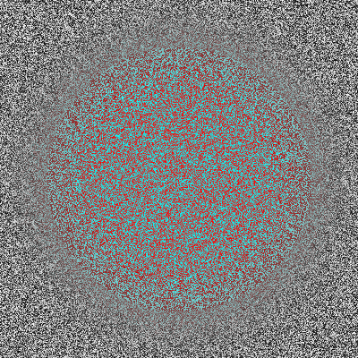 |
| Case 2 |  |  |  |

## Softlight

| Case | Background | Foreground | Output |
|------|---------|------|--------|
| Case 1 |  |  |  |
| Case 2 |  |  | 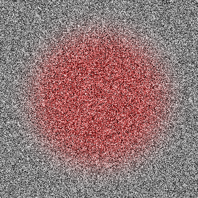 |
| Case 2 |  |  |  |

## Hardlight

| Case | Background | Foreground | Output |
|------|---------|------|--------|
| Case 1 |  |  |  |
| Case 2 |  |  | 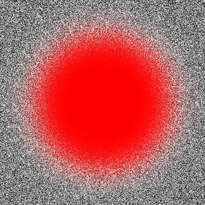 |
| Case 2 |  |  |  |

## Grainextract

| Case | Background | Foreground | Output |
|------|---------|------|--------|
| Case 1 |  |  |  |
| Case 2 |  |  | 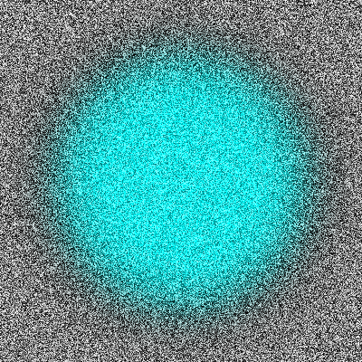 |
| Case 2 |  |  |  |

## Grainmerge

| Case | Background | Foreground | Output |
|------|---------|------|--------|
| Case 1 |  |  |  |
| Case 2 |  |  | 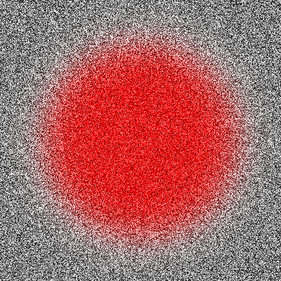 |
| Case 2 |  |  | 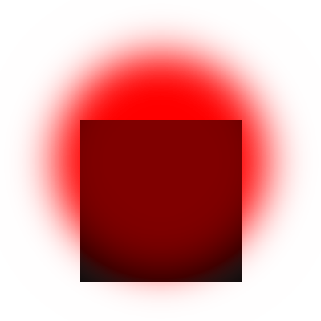 |

## Divide

| Case | Background | Foreground | Output |
|------|---------|------|--------|
| Case 1 |  |  |  |
| Case 2 |  |  | 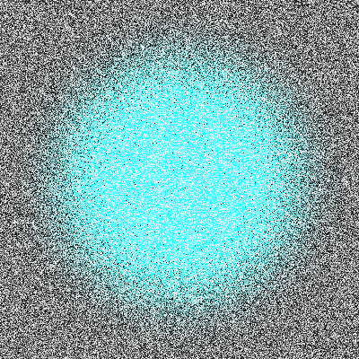 |
| Case 2 |  |  |  |

## Hue

| Case | Background | Foreground | Output |
|------|---------|------|--------|
| Case 1 |  |  |  |
| Case 2 |  |  | 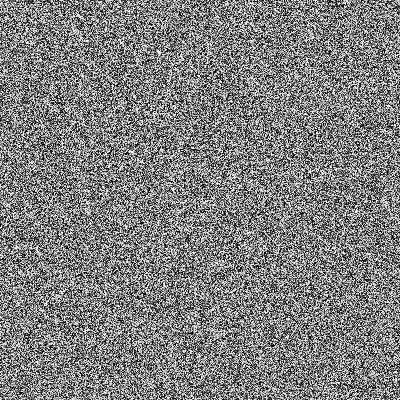 |
| Case 2 |  |  |  |

## Saturation

| Case | Background | Foreground | Output |
|------|---------|------|--------|
| Case 1 |  |  |  |
| Case 2 |  |  |  |
| Case 2 |  |  | 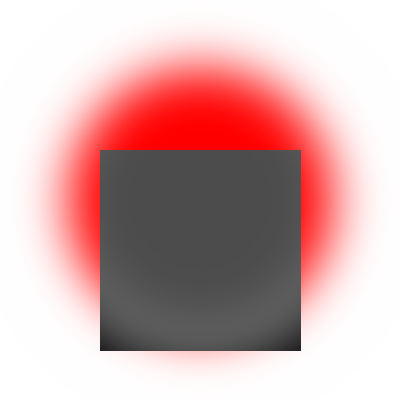 |

## Colour

| Case | Background | Foreground | Output |
|------|---------|------|--------|
| Case 1 |  |  |  |
| Case 2 |  |  | 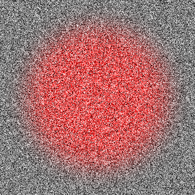 |
| Case 2 |  |  |  |

## Luminosity

| Case | Background | Foreground | Output |
|------|---------|------|--------|
| Case 1 |  |  |  |
| Case 2 |  |  | 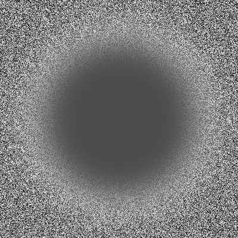 |
| Case 2 |  |  |  |

## Pinlight

| Case | Background | Foreground | Output |
|------|---------|------|--------|
| Case 1 |  |  |  |
| Case 2 |  |  | 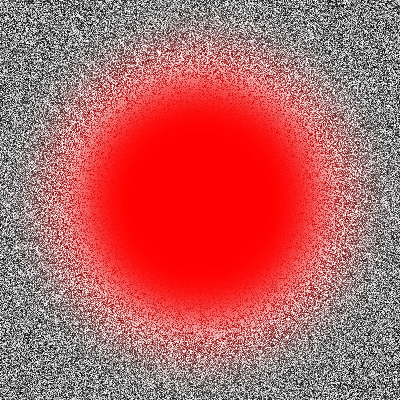 |
| Case 2 |  |  | 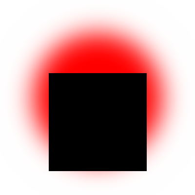 |

## Vividlight

| Case | Background | Foreground | Output |
|------|---------|------|--------|
| Case 1 |  |  |  |
| Case 2 |  |  | 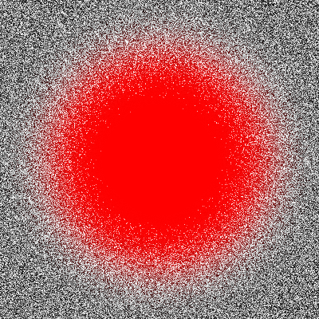 |
| Case 2 |  |  |  |

## Exclusion

| Case | Background | Foreground | Output |
|------|---------|------|--------|
| Case 1 |  |  |  |
| Case 2 |  |  | 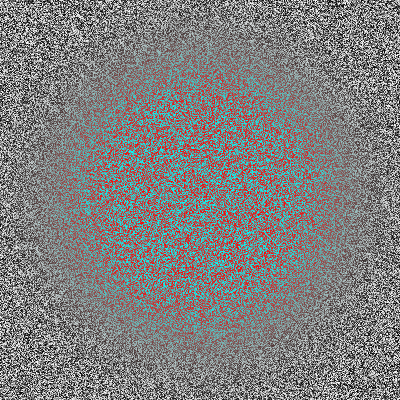 |
| Case 2 |  |  |  |

## Destin

| Case | Background | Foreground | Output |
|------|---------|------|--------|
| Case 1 |  |  |  |
| Case 2 |  |  | 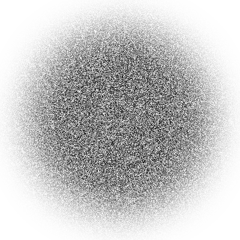 |
| Case 2 |  |  | 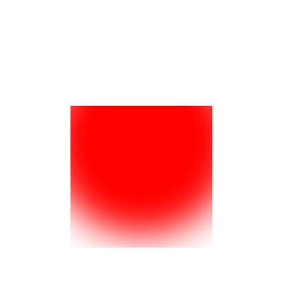 |

## Destout

| Case | Background | Foreground | Output |
|------|---------|------|--------|
| Case 1 |  |  |  |
| Case 2 |  |  | 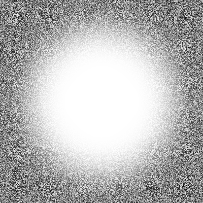 |
| Case 2 |  |  | 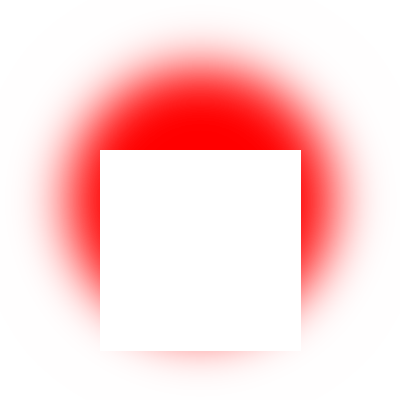 |

## Destatop

| Case | Background | Foreground | Output |
|------|---------|------|--------|
| Case 1 |  |  |  |
| Case 2 |  |  |  |
| Case 2 |  |  | 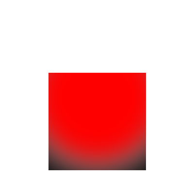 |

## Srcatop

| Case | Background | Foreground | Output |
|------|---------|------|--------|
| Case 1 |  |  |  |
| Case 2 |  |  |  |
| Case 2 |  |  | 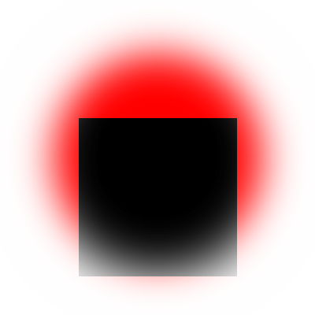 |
